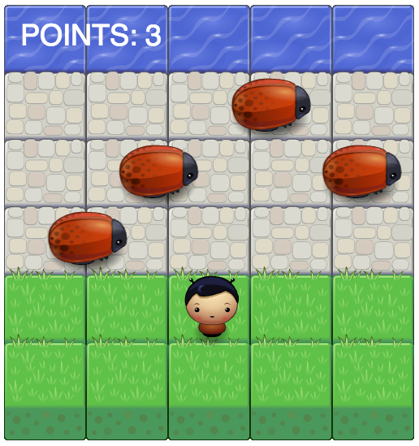

frontend-nanodegree-arcade-game
===============================

This is a simple version of the arcade game [Frogger](https://en.wikipedia.org/wiki/Frogger).

How to Start
-----------

Clone this repository onto your machine:

    $ git clone https://github.com/cg94301/frontend-nanodegree-arcade-game.git

Open index.html in your browser to start the game.

How to Play
-----------

You can move the player with the arrow keys on your keyboard:

  >UP  
  DOWN  
  LEFT  
  RIGHT

The player will move one field per keystroke.
The goal is to reach the water on the other side of the road without hitting any of the beetles.
Each time the water is reached a point is added.
Each time a beetle is hit a point is subtracted.
